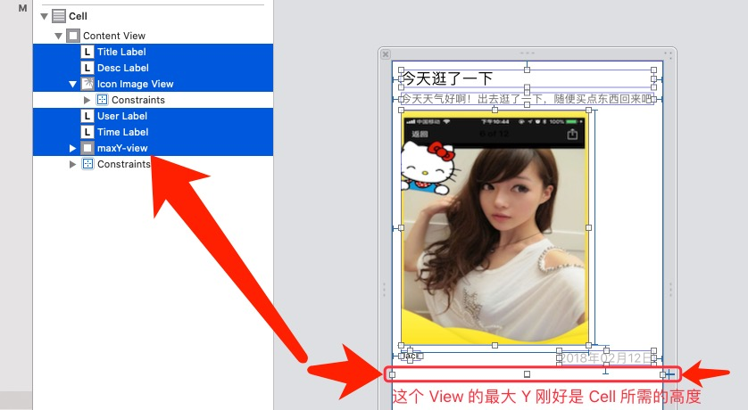
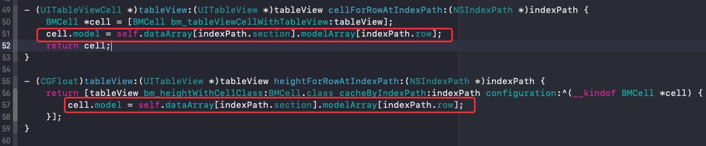
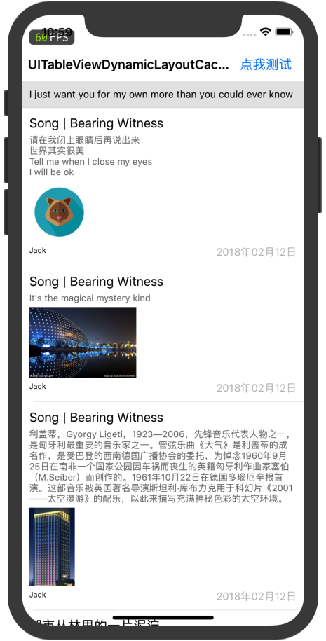

## 效果演示

<p align="center">
    
<p/>
<p align="center">
    
<p/>

<p align="center">
<a href="#"></a>
<a href="#"></a>
<a href="#"></a>
<a href="#"></a>
</p>

## 介绍

-  [UITableViewDynamicLayoutCacheHeight](https://github.com/liangdahong/UITableViewDynamicLayoutCacheHeight) 是一个便捷的，高性能的自动计算使用 `Autolayout` 布局【`Xib`、`StoryBoard`、`Masonry` ...】的 `UITableViewCell` 和 `UITableViewHeaderFooterView` 的高度，支持横竖屏，内部自动管理高度缓存。

##  CocoaPods 安装

```ruby
pod 'UITableViewDynamicLayoutCacheHeight'
pod install
#import <UITableViewDynamicLayoutCacheHeight/UITableViewDynamicLayoutCacheHeight.h>
```

##  手动安装

- 下载项目 【 `clone https://github.com/liangdahong/UITableViewDynamicLayoutCacheHeight.git` 】
- 将 `UITableViewDynamicLayoutCacheHeight/Sources/UITableViewDynamicLayoutCacheHeight`  文件夹下的全部内容拖拽到你的项目。

## 图文使用说明

### `Cell` 使用 `Xib` 构建

- 创建你的 Cell 且使用约束布局， 保证【 Cell 中的 View 从上向下布局，最底部的 View 的 MaxY 刚好是 Cell 所需高度即可】【不要设置底部约束限制，从上向下布局即可，内部会自动去获取最底部的 View 然后把它的 MaxY 做为 Cell 所需的高度 在 [代码 129~150 行 可查看获取过程](https://github.com/liangdahong/UITableViewDynamicLayoutCacheHeight/blob/master/Sources/UITableViewDynamicLayoutCacheHeight/UITableView%2BBMDynamicLayout.m)，然后做各种缓存操作 】 




- 在 UITableView 获取高度的代理方法里实现如下代码，Block 中的代码和 `- (UITableViewCell *)tableView:(UITableView *)tableView cellForRowAtIndexPath:(NSIndexPath *)indexPath`  中的代码一致即可。



- 现在你的 `UITableView`  已经`自动算高`且`自动缓存高度`了，效果如下：
- 
- 更多使用请参考 [UITableView+BMDynamicLayout](<https://github.com/liangdahong/UITableViewDynamicLayoutCacheHeight/blob/master/Sources/UITableViewDynamicLayoutCacheHeight/UITableView%2BBMDynamicLayout.h>) 文件的 API。

## 框架实现原理

### 高度计算原理

提前创建 Cell，然后填充内容，然后强制布局，然后获取 Cell 中 MaxY 最大的 View，然后取此 View 的 MaxY 为 Cell 所需高度【所以`保证 Cell 中的 View 的 MaxY 最大的值即为 Cell 需要的高度`至关重要】，内部会自动管理缓存的保存和清空操作。

## 问题

- 系统自动算高的缺陷大家应该都比较清楚，如：没缓存，重复计算，界面跳动，由于是边滚边算在布局复杂的 Cell 有一些问题，只支持iOS8+，布局必须要填充整个 Cell，在布局的时候一些场景需要设置优先，不然会报约束冲突。

- [UITableView-FDTemplateLayoutCell](https://github.com/forkingdog/UITableView-FDTemplateLayoutCell) 最开始我使用是此框架，同时 API 设计也参考自 FDTemplateLayoutCell，还用了几张素材，😁，在此感谢了 ，但后面有一些 Bug 一直没处理 😭，布局必须要填充整个 Cell，在布局的时候一些场景需要设置优先级，不然会报约束冲突，就迁移到了 [UITableViewDynamicLayoutCacheHeight](https://github.com/liangdahong/UITableViewDynamicLayoutCacheHeight)。

- [UITableViewDynamicLayoutCacheHeight](https://github.com/liangdahong/UITableViewDynamicLayoutCacheHeight) 的缺陷有，
- - ① 可能会多加一个 View【可以在计算的结果上加上底部距离，不建议这样处理】
- - ② 配置 Cell 的代码要在 2 个地方写，和 [UITableView-FDTemplateLayoutCell](https://github.com/forkingdog/UITableView-FDTemplateLayoutCell) 类似。

- 基于此框架实现了一个简陋的微信朋友圈功能 [微信朋友圈](https://github.com/liangdahong/UITableViewDynamicLayoutCacheHeight/tree/master/Demo/%E5%BE%AE%E4%BF%A1%E6%9C%8B%E5%8F%8B%E5%9C%88Demo) 代码是几年前随便写的 😂，没准备调整了，感兴趣的可以瞧瞧。

## 联系
- 欢迎 [issues](https://github.com/liangdahong/UITableViewDynamicLayoutCacheHeight/issues) 和 [PR](https://github.com/liangdahong/UITableViewDynamicLayoutCacheHeight/pulls)
- 也可以添加如下的微信交流和学习
-  

## License    
[UITableViewDynamicLayoutCacheHeight](https://github.com/liangdahong/UITableViewDynamicLayoutCacheHeight) is released under the [MIT license](LICENSE). See LICENSE for details.
