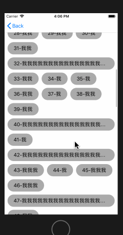
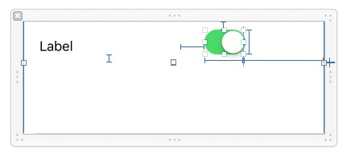
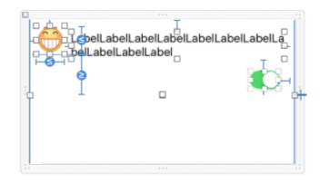
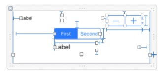
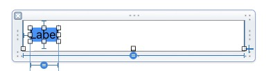

# UITableView-BMTemplateLayoutCell
> 对UITableView之UITableViewCell和UITableViewHeaderFooterView高度自适应并缓存

# 写在前面
> 由于最近需要做一个类似微信聊天窗口的功能,牵涉到`UITableViewCell`的高度自适应，同时需要准确获取`UITableView`的`contentSize`并做相应的滚动和动画，在反复尝试使用系统自适应和[FDTemplateLayoutCell](https://github.com/forkingdog/UITableView-FDTemplateLayoutCell)均有一些小问题待处理，代码计算又太麻烦，故尝试自己实现。

## 原因
1. 系统自动计算无法满足准确获取`contentSize`。
2. 系统自动计算效率较低（来回反复计算）。
3. 系统自动计算对UITableViewHeaderFooterView的自适应不友好。
4. [FDTemplateLayoutCell](https://github.com/forkingdog/UITableView-FDTemplateLayoutCell)似乎在`iOS10.2.1`会崩溃，而且有一些问题一直未处理。
5. 代码计算太繁琐而且容易错（效率最高，但可能很少人用吧）

## 存在的问题
1. 此库可能会额外增加一个View提供布局需要（ps：如果自定义了分割线其实是不需要增加的）

# 使用说明
> 注意：`BMTemplateLayoutCell的实现原理是：内部创建Cell，然后使用Block让外部进行设值和布局，内部在使用 layoutIfNeeded 强制布局，在获取Cell的contentView的最底部的View的最大高度为Cell需要的高度，所以使用者不可对您自定义的Cell设置任何的底部约束限制，所以可能需要您额外增加一个View（记住把它的高度最好设置为0，它的唯一功能是提供布局需要），直接由顶部布局下来即可，放心内部会处理好的`

> 在`Cell`中必须保证有一个视图的`最大Y`即是`Cell`的高度,具体可以查看`demo`中的`xib`约束设置。
1. 支持`xib` `masonry`
2. 支持`注册方式`和`alloc方式`创建`Cell`

# 存在的问题
1. 部分代码暂未优化，以后会优化。


# 效果
##  gif效果图

<p align="center">

</p>

## Xib约束图
<p align="center">

</p>

<p align="center">

</p>

<p align="center">

</p>

<p align="center">

</p>


# 集成
## CocoaPods
> 推荐使用 CocoaPods 安装,Cocoapods的使用请点这里[链接1](http://idhong.com/2016/10/26/cocoapods%E7%9A%84%E7%AE%80%E5%8D%95%E4%BD%BF%E7%94%A8/)、[链接2](http://www.pluto-y.com/cocoapods-getting-stared/)、[链接3](http://blog.devtang.com/2014/05/25/use-cocoapod-to-manage-ios-lib-dependency/)

1. 在 `Podfile ` 中添加 `pod 'BMTemplateLayoutCell', '1.0.2'` 
2. 执行 `pod install` 或 `pod update`
3. 使用的地方导入 `UITableView+BMTemplateLayoutCell.h`
4. 如果无法找到 `BMTemplateLayoutCell`可用 `pod setup`或 `rm ~/Library/Caches/CocoaPods/search_index.json` 在 `pod search BMTemplateLayoutCell`

## 手动安装

1. 通过 `Clone ` 或者 `download ` 下载`BMTemplateLayoutCell` 文件夹内的所有内容。
2. 将 BMTemplateLayoutCell 内的源文件添加(拖放)到你的工程。
3. 导入 `"UITableView+BMTemplateLayoutCell.h"`


# API浏览
```c
#import <UIKit/UIKit.h>

/**
 BMLayoutCellConfigurationBlock

 @param layoutCell 需要布局的Cell
 */
typedef void (^BMLayoutCellConfigurationBlock)(__kindof UITableViewCell *layoutCell);

/**
 BMLayoutHeaderFooterViewConfigurationBlock
 
 @param headerFooterView 需要布局的tableViewHeaderFooterView
 */
typedef void (^BMLayoutHeaderFooterViewConfigurationBlock)(__kindof UITableViewHeaderFooterView *headerFooterView);

#pragma mark - BMTemplateLayoutCell

/**
 BMTemplateLayoutCell
 */
@interface UITableView (BMTemplateLayoutCell)

/**
 获取 Cell 的高度（内部不做任何缓存操作））

 @param clas Cell Class
 @param configuration 布局block
 @return 应该的高度
 */
- (CGFloat)fd_heightForCellWithCellClass:(Class)clas configuration:(BMLayoutCellConfigurationBlock)configuration;

/**
 获取 Cell 的高度（内部自动处理缓存））
 
 @param clas Cell Class
 @param indexPath 内部会使用 indexPath 做缓存
 @param configuration 布局block
 @return 应该的高度
 */
- (CGFloat)bm_heightForCellWithCellClass:(Class)clas cacheByIndexPath:(NSIndexPath *)indexPath configuration:(BMLayoutCellConfigurationBlock)configuration;

/**
 获取 Cell 的高度（内部自动处理缓存））

 @param clas Cell Class
 @param key 唯一key，内部会以次key来做缓存
 @param configuration 布局block
 @return 应该的高度
 */
- (CGFloat)bm_heightForCellWithCellClass:(Class)clas cacheByKey:(NSString *)key configuration:(BMLayoutCellConfigurationBlock)configuration;

@end

#pragma mark - BMTemplateLayoutHeaderFooterView

/**
 BMTemplateLayoutHeaderFooterView
 */
@interface UITableView (BMTemplateLayoutHeaderFooterView)

/**
 获取 HeaderFooterView 的高度（内部不做任何缓存操作）

 @param clas HeaderFooterView class
 @param configuration 布局block
 @return 应该的高度
 */
- (CGFloat)bm_heightForHeaderFooterViewWithWithHeaderFooterViewClass:(Class)clas configuration:(BMLayoutHeaderFooterViewConfigurationBlock)configuration;

/**
 获取 HeaderFooterView 的高度（内部自动处理缓存）

 @param clas HeaderFooterView class
 @param isHeaderView 是否是表头（组的头部：YES 组的尾部：NO）
 @param section 内部会使用 section 做缓存
 @param configuration 布局block
 @return 应该的高度
 */
- (CGFloat)bm_heightForHeaderFooterViewWithWithHeaderFooterViewClass:(Class)clas isHeaderView:(BOOL)isHeaderView section:(NSInteger)section configuration:(BMLayoutHeaderFooterViewConfigurationBlock)configuration;

/**
 获取 HeaderFooterView 的高度（内部自动处理缓存）
 
 @param clas HeaderFooterView class
 @param key 唯一key，内部会以次key来做缓存
 @param configuration 布局block
 @return 应该的高度
 */
- (CGFloat)bm_heightForHeaderFooterViewWithWithHeaderFooterViewClass:(Class)clas cacheByKey:(NSString *)key configuration:(BMLayoutHeaderFooterViewConfigurationBlock)configuration;

@end

```

